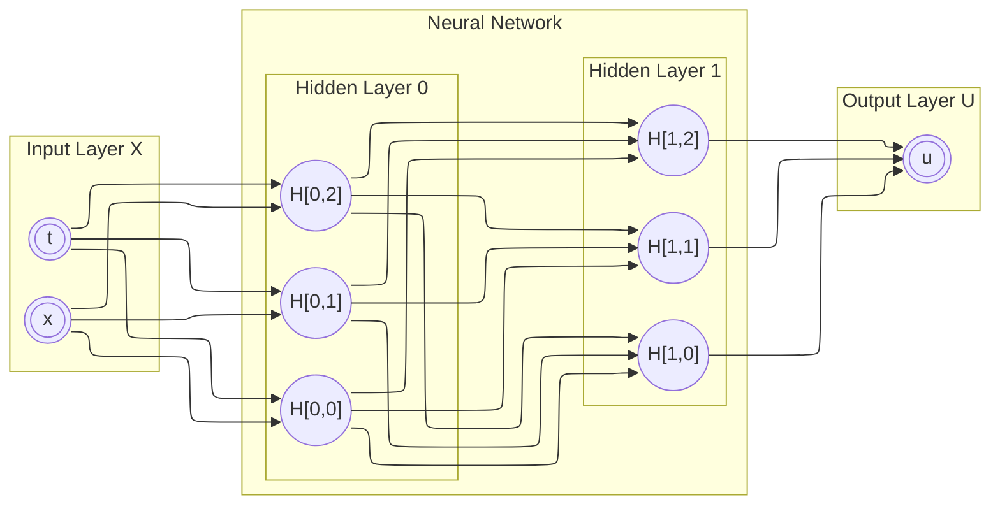

# PINN experiments in python

Trying out _Physics Informed Neural Networks_ (PINNs) in python.

# 1. Solving a PDE via Classical Neural Networks

## Problem statement

We are given the following partial differential equation and boundary conditions:

$$\begin{align}
\text{PDE:} \quad & \frac{\partial u}{\partial x} = 2 \frac{\partial u}{\partial t} + u \\
\text{Boundary Conditions:} \quad & u_{(x, 0)} = 6 \cdot e^{-3x} \\
& x \in \left[0, 2\right] \\
& t \in \left[0, 1\right]
\end{align}$$

## Exact solution

Lets try to solve the problem analytically to arrive at an exact solution, and perhaps gain some intuition on how our neural network should be designed to solve the PDE effectively.

Given the shape of the PDE, let's assume that $u_{(x, t)}$ carries the following form:

$$
u_{(x, t)} = A \cdot e^{\omega t + \gamma x} \quad , \quad \text{where} \quad A, \omega, \gamma \in \Bbb{R}
$$

Let's compute the partial differentials of $u$ with respect to $x$ and $t$, since they are used in the PDE:

$$
\frac{\partial u}{\partial x} = \gamma u \quad , \quad \frac{\partial u}{\partial t} = \omega u
$$

Substituting this form of $u$ back into the original PDE gives us:

$$\begin{align}
& \gamma u = 2 \omega u + u \\
\rightarrow \quad & \boxed{\gamma = 2 \omega + 1} \\
\therefore \quad & u_{(x, t)} = A \cdot e^{\omega t + (2 \omega + 1) x}
\end{align}$$

Applying the boundary condition now gives us:

$$\begin{align}
& \left. u_{(x, t)} \right|_{t = 0} = 6 \cdot e^{-3x} \\
\rightarrow \quad & A \cdot e^{(2 \omega + 1) x} = 6 \cdot e^{-3x} \\
\therefore \quad & \boxed{A = 6} \\
\text{and} \quad & 2 \omega + 1 = -3 \\
\rightarrow \quad & \boxed{\omega = -2} \\
\end{align}$$

Thus, we now have the exact solution to $u$ :

$$
\boxed{u_{(x, t)} = 6 \cdot e^{-2t - 3x}}
$$

## Breaking down the problem for Classical Neural Networks

### Where do we get our training data from?

We use the boundary condition $u_{(x, 0)}$ to generate any number of data points (for $x \in [0, 2]$ ).
Needless to say, these data points will be somewhat lacking, as they only occupy the span of one line, instead of the whole plane of possible values for $x$ and $t$ .

### What is the loss function here?

Suppose we run the neural network with input points $(x, t) \in \Gamma$ (in other words: $\Gamma \subset [0, 2] \times [0, 1]$ ).
Then, the resulting predicted output values of $u$ for each data point will be $\widetilde{u}_ {(x, y)}$ ,
with the actual "true" (training data) values being $u_{(x, t)}$ .

The loss function $\mathcal{L}_ {u}$ is then defined as the mean-squared-difference between the expectation $\widetilde{u}_ {(x, y)}$ , and the training value $u_ {(x, t)}$ .

$$\begin{gathered}
\mathcal{L}_ {u} = \frac{1}{\\#{\Gamma}} \sum_{\forall (x, t) \in \Gamma}{ \left( u_{(x, t)} - \widetilde{u}_{(x, y)} \right)^{2} } \\
\text{where } \\#{\Gamma} \text{ represents the number of elements in the set } \Gamma \text{ (i.e. cardinality)}
\end{gathered}$$

### What are the components of a Neural Network?

Any neural network with one or more hidden layers can be thought as a universal function approximator (citation needed).
A single layer in a neural network consists of nodes that are independent of each other, but depend on the output values of the previous layer(s)'s nodes (unless they are in the input layer).

There are 3 types of layers:

- `Input Layer`: The nodes of this layer is fed your input data (which would be the values of $x$ and $t$ in our scenario).
- `Hidden Layer`: The nodes of this layer take in the values from the previous layer, apply some _non-linear_ function (usually a linear combination, followed by a non-linear activation function), and then return their output computed values.
- `Output Layer`: The nodes in this layer are the end-points of your neural network.
  Unlike the hidden layer, these nodes typically perform a _linear_ operation on the output of the previous hidden layer.

### Significance of Non-Linearity

#### Assuming Linear Hidden Layers

Why is it essential for the hidden nodes of the neural network to be non-linear?

Well, suppose that we had a neural network with input $\vec{X}$ , outputs $\vec{U}$ , and $N$ _linear_ hidden layers $H_{0}, H_{1}, \dots, H_{N - 1}$ (representable as matrices), in addition to $H_{N}$ for transforming the output of $H_{N - 1}$.
Now, this effectively means that the output value $\vec{U}$ for a certain input $\vec{X}$ can be computed as the following matrix multiplication:

$$
\vec{U} = H_{N} H_{N - 1} \cdots H_{1} H_{0} \vec{X}
$$

But we can reduce (precompute) the matrix multiplications into just a single matrix $G =  H_{N} H_{N - 1} \cdots H_{1} H_{0}$ , simplifying our expression to:

$$
\vec{U} = G \vec{X}
$$

And since, all $H_{i \in \{0, 1, \dots, N\}}$ matrices were independent of the input nodes $\vec{X}$ , we can use $G$ to perform a computation of any $\vec{U}$ via a single matrix multiplication of $\vec{X}$ .

In essence, we have collapsed our $N$ hidden layers into precisely _zero_ hidden layers.
In fact, this is single-matrix-multiplication formulation is precisely what _linear regression_ is.
And we're not here to do linear regression, are we?

> Takeaway: A Neural Network with linear hidden layers is equivalent to zero hidden layers.
> You're just performing linear-regression in a much less efficient way.

#### Assuming Non-Linear Hidden Layers

So what does introducing non-linearity do to our system?

Let's step back and first transform our linear example's hidden layers to non-linear layers.
To do so, we simply pick a non-linear 1D function $s_{(v)}$ of our choice (such as a [_sigmoid_](https://en.wikipedia.org/wiki/Sigmoid_function) or a [_ReLU_](https://en.wikipedia.org/wiki/Rectifier_(neural_networks))), and apply that non-linear function to each hidden layer's node's output value.

To simplify our declaration for matrix-wise operations, we need to introduce the following vector notation:

$$
s(\vec{Y}) \coloneqq \langle s(Y_{0}), s(Y_{1}), \dots, s(Y_{M - 1}) \rangle
$$

So now, in terms of layer-wise matrices, we get the following expression for computing $\vec{U}$ , given some input $\vec{X}$ :

$$
\vec{U} = H_{N} \cdot s(H_{N - 1} \cdots s(H_{1} s(H_{0} \vec{X})))
$$

And it would now be clear to you that this expression is irreducible.
Hence, we cannot pre-compute any part of this expression to make it smaller without having a concrete value of $\vec{X}$ .

The non-linearity portions are what make neural networks fundamentally different from statisctical methods.
Every layer must exhibit some form of non-linearity, otherwise it _will_ be reducible.

### Conventional Neural Networks

Typically, the hidden nodes of a neural network use simple matrix-based linear computation on their inputs, then add a constant bias value, and finally follow it up by applying a non-linear function onto each element of the output vector.

Given a hidden layer $H^{(k)}$ , with dimensionality $Dim(H^{(k)}) = \langle a, b \rangle$ ($b$ number of inputs and $a$ number of outputs (i.e. $a$ is also the number of nodes in that layer)):

- Each node $i \in \{1, \dots, a\}$ is a $(1 \times b)$ matrix, consisting of:
  - The matrix entries $W_{ij}$ (for $j \in \{1, \dots, b\}$ ), known as the `weights` of the $i^{th}{-}\text{node}$.
  - The scalar value $B_{i}$, known as the `bias` of the $i^{th}{-}\text{node}$.
  - A scalar non-linear function $S_{i (v)}$ , known as the `activation function` of the $i^{th}{-}\text{node}$.
- Thus an input $b{-}\text{dimensional}$ vector $\vec{V}$ will be transformed by the $i^{th}{-}\text{node}$ into the scalar value:

$$
S_{i}(B_{i} + W_{i:} \vec{V})
$$

- Therefore, the layer as a whole transforms some $b{-}\text{dimensional}$ input $\vec{V}$ to the $a{-}\text{dimensional}$ vector:

$$
H^{(k)}(\vec{V}) \coloneqq S(B + W_{::} \vec{V})
$$

- To make it clearer that each component of the expression is associated with the $k^{th}$ hidden layer, we use the $(k)$ superscript on each component:

$$
H^{(k)}(\vec{V}) \coloneqq S^{(k)}(B^{(k)} + W^{(k)} \vec{V})
$$

As a whole, our $N$ hidden-layered neural network can now be mathematically defined as:

$$\begin{align}
\vec{U} & = H^{(N)} \circ H^{(N - 1)} \circ \dots \circ H^{(1)} \circ H^{(0)} \vec{X} \\
& = H_{N} \circ S^{(N - 1)}(B^{(N - 1)} + W^{(N - 1)}( \dots S^{(1)}(B^{(1)} + W^{(1)}( S^{(0)}(B^{(0)} + W^{(0)}( \vec{X} )) )) ))
\end{align}$$

But it might be clearer to write the recursion iteratively:

$$\begin{align}
\vec{h}^{(-1)} & \coloneqq \vec{X} \\
\vec{h}^{(k)} & \coloneqq S^{(k)}(B^{(k)} + W^{(k)} \vec{h}^{(k - 1)}) \quad , \quad \text{for } k \in \{0, \dots, N\} \\
S^{(k)} & \hspace{0.5em} \text{is a non-linear function} \quad , \quad \text{for } k \in \{0, \dots, N - 1\} \\
S^{(N)} & \coloneqq \Bbb{1} \quad \text{(the identity function (linear))} \\
\vec{U}^{(k)} & \coloneqq \vec{h}^{(N)}
\end{align}$$

### What does the Neural Network look like?

If we were using a $2 \times 3$ neural network (2 hidden layers, with 3 nodes each) to solve our 2-input and 1-output problem, then, it can be illustrated on a graph as the following:

## Further reading

- Explain measuring the goodness of our weights + biases via the total error
- Explain back propagation
- Explain gradient-descent, and how it is achieved via back propagation

For completeness, read the following excellent slides on mathematical introduction to neural networks: [University of Toronto, CSC411, Lecture 10](https://www.cs.toronto.edu/~jlucas/teaching/csc411/lectures/lec10_handout.pdf)

# 2. Solving a PDE via Physics Informed Neural Networks (PINN)

TODO
